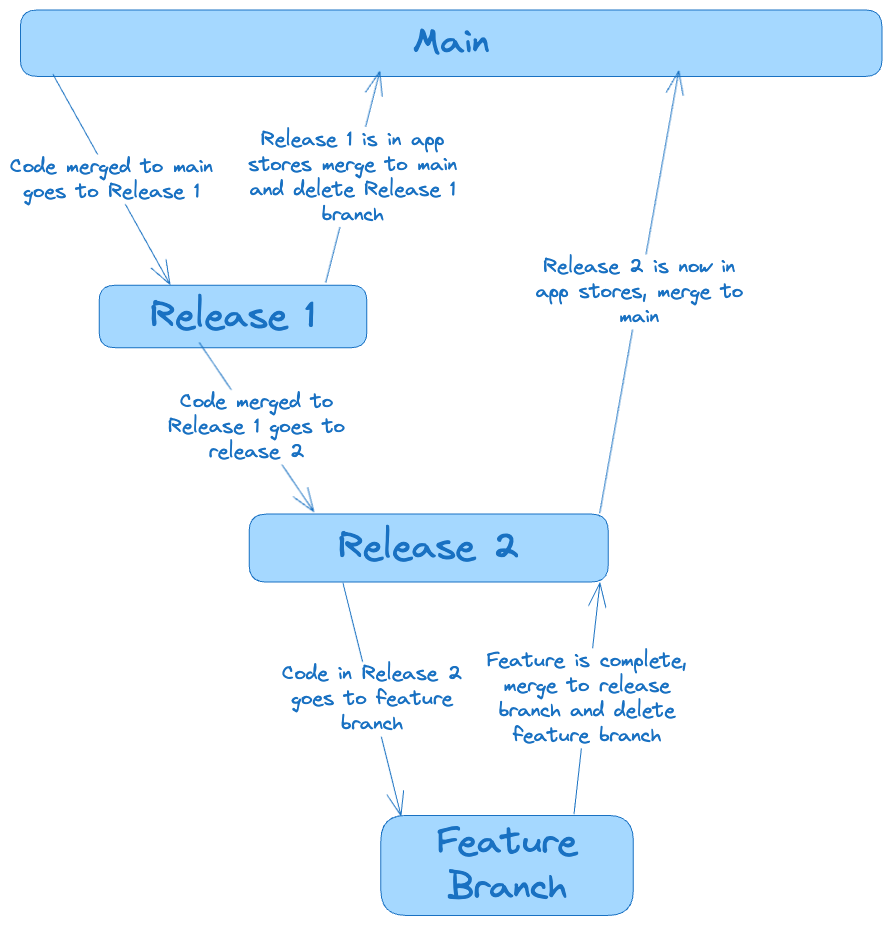

# Building the App - iOS

### Install JS/React Native Dependencies

```
yarn
```

### Install iOS Dependencies

```
npx pod-install
```

### Build the iOS App

Open ios/Converse.xcworkspace in Xcode and Build

# Building the App - Android

### Install JS/React Native Dependencies

```
yarn
```

### Build the Android App

Open Android Studio
press the top right gradle icon to sync gradle
Click the play/build button to build and install the app

### Forward backend port

if running the backend locally

```
yarn android:reverse
```

# Building the App - Web

### Please Note

Currently Groups and V3 Identity is not supported on Web at the SDK layer, but is actively being worked on by the team

Until then Converse web will only show 1 to 1 conversations and the majority of testing and development are native app focused.

Web support is an end goal and the team is happy to fix any issues that are reported

### Install JS/React Native Dependencies

```
yarn
```

### Building the Web App

```
yarn start
```

Once the expo server starts press W to launch the web app

# Running the App

Once the app builds it will open the Expo App
this will ask what server port you are targetting, if none are found, you probably need to start the expo server

### Start Expo Server

```
yarn start
```

# Linting

```
yarn lint
```

# Testing

## Running Jest tests

Before running the tests make sure that you have a `.env` file setup with the variables variable set

```sh
yarn test
```

## Running Performance Tests

Capture baselines for performance tests

```sh
yarn test:perf:baseline
```

Make changes to the code to see the performance impact

Run the performance tests again to see the changes

```sh
yarn test:perf
```

# Frames

Frames are expected to follow the Open Frames Standard https://github.com/open-frames/standard

# Release Processes

### Main Branch

Represents the current production code.

### Release Branches

Each release branch is based off of `main` or the release branch before it. It is used to prepare and stabilize the code for a specific release version (e.g., `release/2.0.8`).

### Feature Branches

Feature branches are longer-lived features or refactors expected to take additional time. They should be based off of the targeted feature release branch.

This structure allows code to flow **from `main` to release branches to feature branches**.



---

## Rebasing Branches

Assuming your branch is `feature/scw`, and your feature is targeted for release `2.1.0`, follow these steps to rebase:

1. First, checkout the feature branch:

   ```bash
   git fetch origin
   git branch feature/scw -D
   git checkout feature/scw origin/feature/scw
   ```

2. Then, rebase onto the targeted release branch:
   ```bash
   git pull origin/release/2.1.0 --rebase
   git push origin feature/scw --force-with-lease
   ```

### Exceptions

There are certain times where this flow does not work as intended. For example:

- Build scripts: These may need to be run off of the default main branch instead of feature or release branches.
- Read me updates: These are not required to be on a branch and can be committed directly to main.
- Bug fixes that can be OTA updated: These can be committed directly to main to perform an OTA update.

## Firebase Configuration

Firebase config files are not stored in git for security. New team members need to:

1. Obtain the Firebase config files from the private repository at https://github.com/ephemeraHQ/converse-app-env
2. Copy them into the correct locations:

iOS:

- ios/Google Services/GoogleService-Info.plist (prod)
- ios/Google Service-Info-preview.plist (preview)
- ios/Google Service-Info-prod.plist (dev)

Android:

TODO

These files are required for building the app but are kept secure outside of version control.
