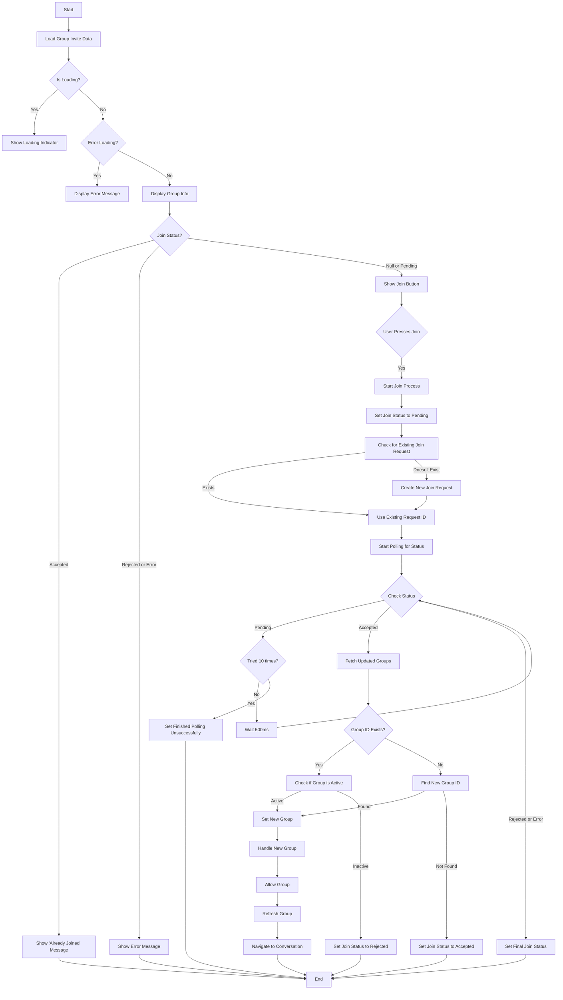

```mermaid
flowchart TD
    A[Start] --> B[Load Group Invite Data]
    B --> C{Is Loading?}
    C -->|Yes| D[Show Loading Indicator]
    C -->|No| E{Error Loading?}
    E -->|Yes| F[Display Error Message]
    E -->|No| G[Display Group Info]
    G --> H{Join Status?}
    H -->|Accepted| I[Show 'Already Joined' Message]
    H -->|Rejected or Error| J[Show Error Message]
    H -->|Null or Pending| K[Show Join Button]
    K --> L{User Presses Join}
    L -->|Yes| M[Start Join Process]
    M --> N[Set Join Status to Pending]
    N --> O[Check for Existing Join Request]
    O -->|Exists| Q[Use Existing Request ID]
    O -->|Doesn't Exist| P[Create New Join Request]
    P --> Q
    Q --> R[Start Polling for Status]
    R --> S{Check Status}
    S -->|Pending| T{Tried 10 times?}
    T -->|No| U[Wait 500ms]
    U --> S
    T -->|Yes| V[Set Finished Polling Unsuccessfully]
    S -->|Accepted| W[Fetch Updated Groups]
    W --> X{Group ID Exists?}
    X -->|Yes| Y[Check if Group is Active]
    Y -->|Active| Z[Set New Group]
    Y -->|Inactive| AA[Set Join Status to Rejected]
    X -->|No| AB[Find New Group ID]
    AB -->|Found| Z
    AB -->|Not Found| AC[Set Join Status to Accepted]
    S -->|Rejected or Error| AD[Set Final Join Status]
    Z --> AE[Handle New Group]
    AE --> AF[Allow Group]
    AF --> AG[Refresh Group]
    AG --> AH[Navigate to Conversation]
    I --> AI[End]
    J --> AI
    V --> AI
    AA --> AI
    AC --> AI
    AD --> AI
    AH --> AI
```
