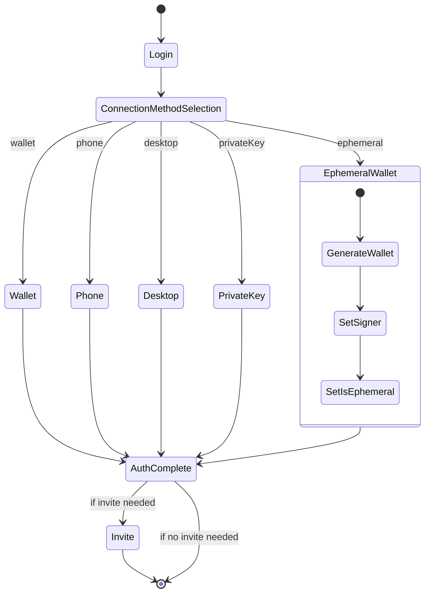
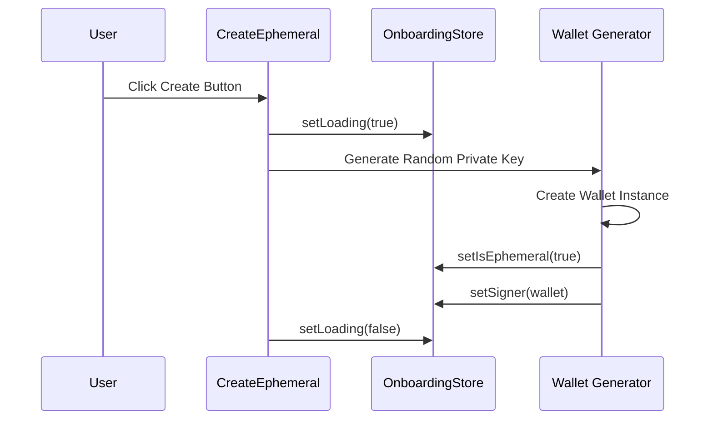
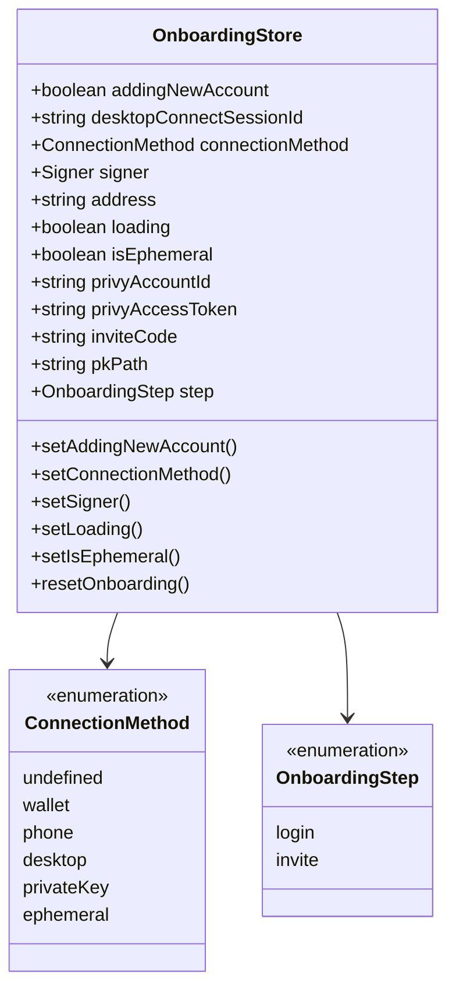
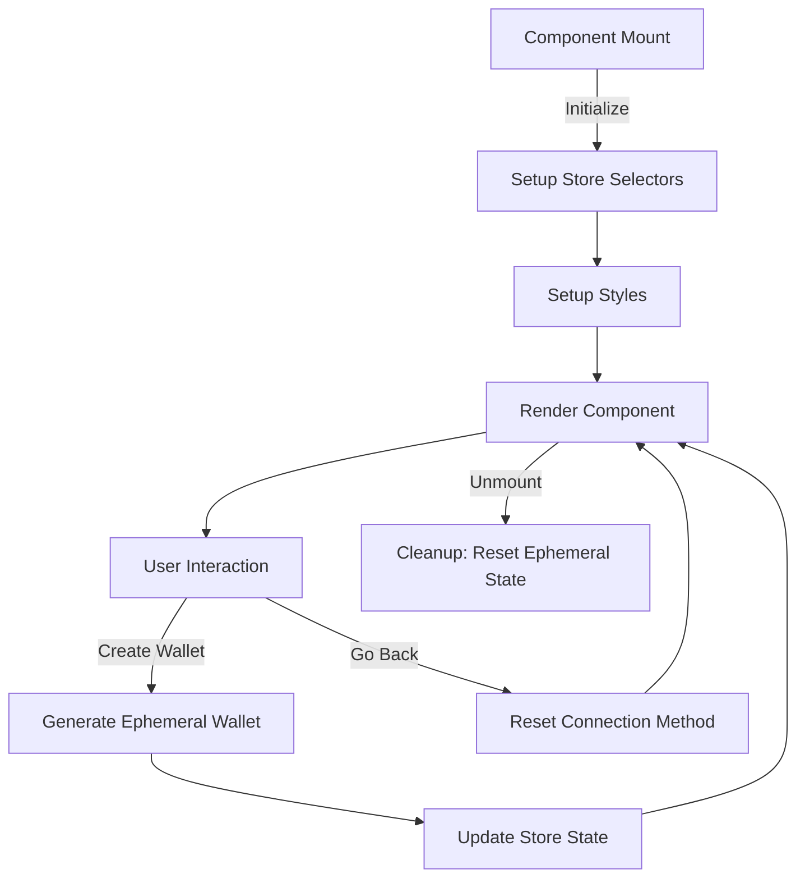
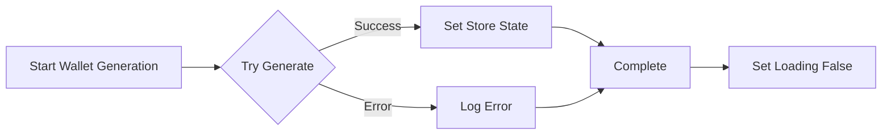

# Onboarding Flow Analysis

## Main Onboarding Flow

## Ephemeral Wallet Creation Flow

## Store State Management

## Component Lifecycle

## Error Handling Flow

These diagrams provide different views of the onboarding flow:

1. The main state flow showing all possible paths
2. The specific sequence for ephemeral wallet creation
3. The store state management structure
4. The component lifecycle and user interactions
5. Error handling flow

Each diagram helps visualize a different aspect of the onboarding process, making it easier to understand the overall architecture and flow of the application.
